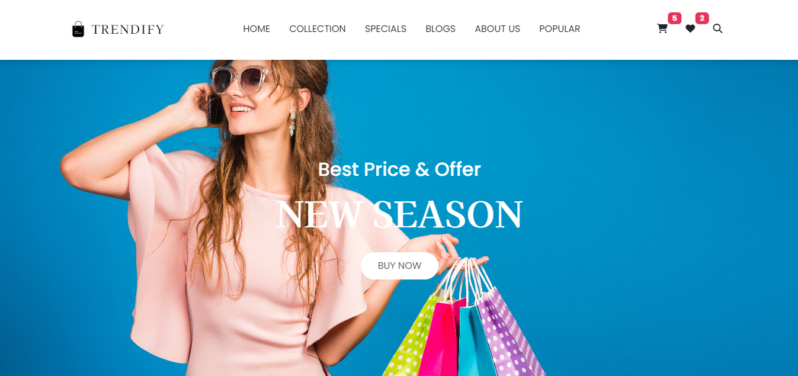
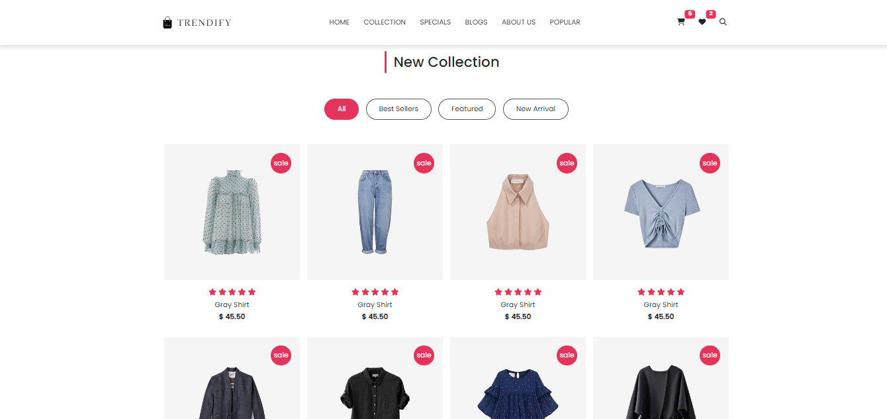
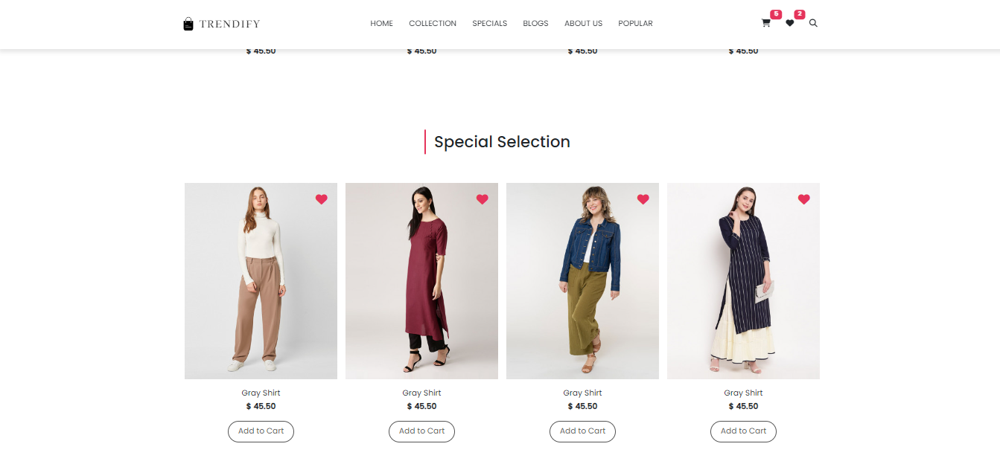
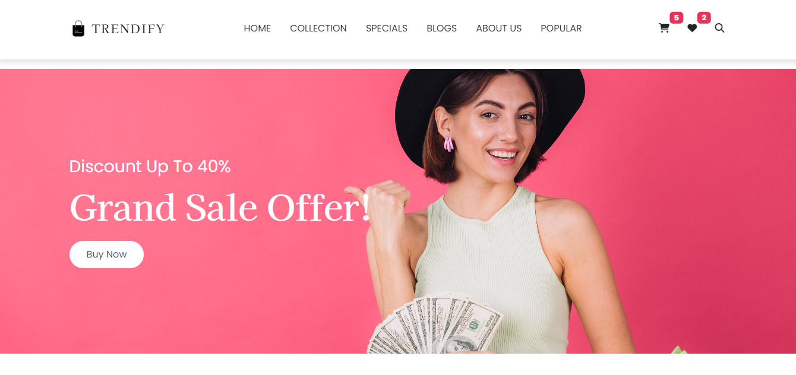
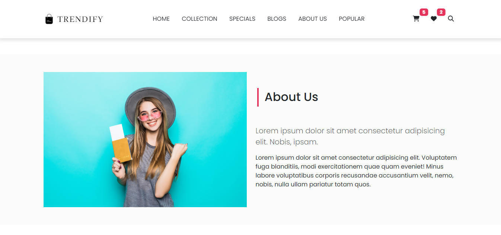
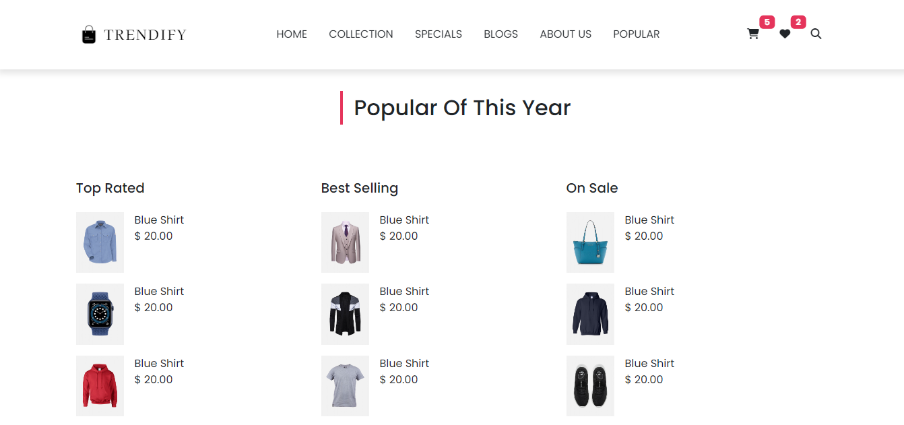
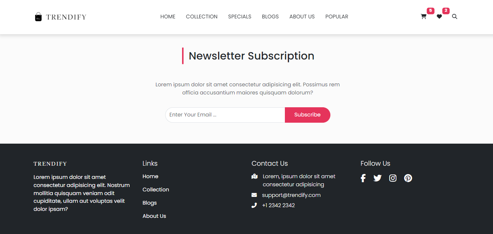

                         
<h1 align="center" style="font-weight: bold;"> 🌟Trendify - Bootstrap E-commerce Website🌟 </h1>

<p align="center">🌟TRENDIFY🌟 is a sleek and responsive e-commerce website built with the power of HTML, CSS, and Bootstrap. Designed to offer a seamless shopping experience, this project is perfect for anyone interested in modern web development and exploring the potential of Bootstrap or Someone who's looking for a ecommerce website.</p>

<p align="center">
<a href="#overview">Overview</a>
<a href="#tech">Technologies</a>
<a href="#features">Features</a>
<a href="#demo">Demo</a>
<a href="#started">Getting Started</a>
<a href="#license">License</a> 
<a href="#contribute">Contributing</a> 
<a href="#contact">Contact</a> 
<a href="#credits">Credits</a> 
</p>

<p align="center">
<a href="https://murtaza-ax.github.io/ecommerce-bootstrap-trendify/">📱 Visit this Project</a>
</p>

<h2 id="overview">🛒 Overview</h2>
<p align="start">**Trendify** is a sleek and responsive e-commerce website built with the power of HTML, CSS, and Bootstrap. Whether you're a developer looking to create an e-commerce platform for your business, a freelancer building a website for a client, or someone with very little time who needs a quick, ready-made solution—**Trendify** has you covered.
This project offers a modern and intuitive shopping experience, designed to impress users with its clean design and easy navigation. Built with scalability in mind, it's perfect for anyone looking to delve into e-commerce web development, utilizing the robust framework of Bootstrap for quick and efficient customization.
If you need a starting point for your next e-commerce project or want to learn how to build a responsive website from scratch, **Trendify** is an excellent resource. Its flexibility makes it suitable for businesses of all sizes, from small startups to established enterprises.
</p>
 
<h2 id="tech">💻 Technologies</h2>

- **HTML5**
- **CSS3**
- **Bootstrap5**


<h2 id="features">✨ Features</h2>

- 💻 **Fully Responsive Design**: Adapts perfectly to any screen size, from mobile devices to desktops.
- 🎨 **Modern UI/UX**: A clean and stylish user interface that enhances the user experience.
- 🧭 **Easy Navigation**: Intuitive layout that makes browsing a breeze.
- 🌐 **Cross-Browser Compatibility**: Works flawlessly across all major browsers.
- 🛠️ **Easily Customizable**: Built with a modular structure, making it simple to modify and expand.
- 🧹 **Clean and Well-Commented Code**: The codebase is organized and easy to understand, making it perfect for developers of all levels.
- 🚀 **Quick Setup**: Get your e-commerce site up and running in no time.
- 🔧 **Scalable Design**: Easily adaptable for projects of any size, from small shops to large e-commerce platforms.


<h2 id="demo">🖼️ Screenshots</h2>
Here are some screenshots of the **Trendify** website:

<table>
  <tr>
    <td align="center">
      
      <br/>
      <b>Header Section</b>
    </td>
    <td align="center">
      
      <br/>
      <b>New Collection Section</b>
    </td>
    <td align="center">
      
      <br/>
      <b>Special Collection Section</b>
    </td>
  </tr>
  <tr>
    <td align="center">
      
      <br/>
      <b>Offer Section</b>
    </td>
    <td align="center">
      
      <br/>
      <b>About Us Section</b>
    </td>
    <td align="center">
      
      <br/>
      <b>Popular Products</b>
    </td>
  </tr>
  <tr>
    <td align="center">
      
      <br/>
      <b>Newsletter & Footer</b>
    </td>
  </tr>
</table>

 
<h2 id="started">🚀 Getting started</h2>

<h3>Prerequisites</h3>

To run this project, you'll need:

- A web browser (Chrome, Firefox, Safari, etc.)
- [Git](https://git-scm.com/) for version control (optional)


<h3>Installation</h3>

1. **Clone the repository**:
    ```bash
      git clone https://github.com/Murtaza-Ax/ecommerce-bootstrap-trendify.git
    ```

2. **Open the project** in your favorite code editor:
    ```bash
      cd ecommerce-bootstrap-trendify
    ```

3. **Run the project**:

    Simply open the `index.html` file in your browser to view the page.


<h2 id="license">📄 License</h2>

This project is licensed under the [MIT License](LICENSE).

 
<h2 id="contribute">🤝 Contribution</h2>

We welcome contributions to **Trendify**! Whether you're fixing bugs, improving documentation, or adding new features, your help is greatly appreciated. 
Here's how to get started:

1. **Fork the Repository**: Click the "Fork" button at the top right of this page to create a copy of the repository under your GitHub account.

2. **Clone the Forked Repository**: Clone your fork to your local machine to start making changes.
     ```bash
       git clone https://github.com/username/trendify-bootstrap-ecommerce.git
     ```
   replace `username` with your actual github name.

3. **Create A New Branch**:  Create a new branch with a descriptive name for your feature or bugfix.

    ```bash
        git checkout -b feature/your-feature-name  
    ```

4. **Make Changes**: Implement your feature or fix the issue. Test your changes thoroughly.

5. **Commit Your Changes**: Write a clear and concise commit message describing your changes.

   ```bash
     git commit -m "your feature name"
   ```
   
6. **Push to the Branch**: Push your changes to your forked repository.
   ```bash
     git push origin feature/your-feature-name
   ```

7. **Create a Pull Request**: Go to the original repository on GitHub and create a pull request. Please provide a detailed explanation of your changes and why they should be merged. 
   
⭐ Thank you for considering contributing to Trendify!

<h3>Documentations that might help</h3>

[📝 How to create a Pull Request](https://www.atlassian.com/br/git/tutorials/making-a-pull-request)

[💾 Commit pattern](https://gist.github.com/joshbuchea/6f47e86d2510bce28f8e7f42ae84c716)


<h2 id="Contact">📧 Contact</h2>

If you have any questions or suggestions, feel free to reach out:

- **GitHub**: [Murtaza-Ax](https://github.com/Murtaza-Ax)
- **Email**: [Murtaza ALi](mailto:murtaza.official264@example.com)

<h2 id="credits">👏 Credits</h2>

This project wouldn't have been possible without the inspiration and design provided by the original website designer. 

### Acknowledgements

- **Bootstrap**: This project is built using the [Bootstrap](https://getbootstrap.com) framework, which made it easy to create a responsive and visually appealing design.
- **FontAwesome**: Icons used in this project are provided by [FontAwesome](https://fontawesome.com).
- **Unsplash**: Placeholder images are sourced from [Unsplash](https://unsplash.com).

---

⭐ If you like this project, consider giving it a star on GitHub! Your support is much appreciated.

Made with ❤️ by Murtaza Ali
